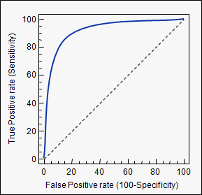

# How to Deal with imbalanced classes
## Motivation
Training data sets for classification models will rarely come with equal classes. What problems will occur if you use data that is not balanced? What happens the more extreme the imbalance gets?

If you build a fraud classification model, as in our most recent case study, and the training data is heavy in not-fraud data, will the resulting model miss (expensive) cases of fraud?

## Methods
Our research didn't turn up a singular, definitive solution to this problem which suggests that it changes case by case. There was a consensus on available/proven methods:

- Compare classification models with confusion matrix and appropriate metrics
- Tune your models threshold by creating an ROC curve
- Undersample and/or oversample your training data to create a more balanced dataset
- **Compare classification models with cost/benefit matrix**

## Confusion Matrix and metrics

Choosing appropriate metric depends on the problem. For fraud classification where the fraud is very expensive, minimize the miss rate (FN/FN+TP). See [wikipedia confusion matrix page](https://en.wikipedia.org/wiki/Confusion_matrix) for full list.

## ROC Curve

To construct ROC Curve:
1. Train a classification model and get the numerical values (probabilities) for each data point classification
2. Sort numerical values so lowest is first
3. Build plot data by iterating over i with the following steps:
  - Take i value as classification threshold
  - Everything before i is class 0, everything after is class 1
  - Calculate new TPR, FPR, save to plot data

[See Listing 7.5 in Machine Learning Book for details](https://drive.google.com/file/d/0B1cm3fV8cnJwcUNWWnFaRWgwTDA/view)

## Balance the classes

- **Undersample** the majority class by deleting examples. Could delete part of signal
- **Oversample** the minority class by duplicating that class data or using it to add new minority data

## Cost/Benefit Matrix

- Just a weighted confusion matrix
- Be careful when constructing a cost/benefit matrix: don't double count a value
- Include in classification algorithm:
  - Adaboost has error weight vector, D
  - Naive Bayes could predict on lowest cost rather than highest probability
